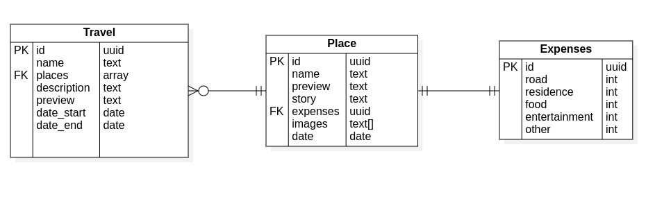

# LTS - Leo`s Travel Stories

## Запуск сервиса

### Запуск локально:
```
docker compose up -d db
make migrate
make run
```

### Запуск в docker контейнере:
```
docker compose build
docker compose up
```

## Спецификация Swagger

Спецификация Swagger доступна в файле `swagger.json`, который можно скачать или просмотреть по следующей ссылке:

[Спецификация Swagger](docs/swagger.json)

## Диаграмма ER

Представлена диаграмма ER:

